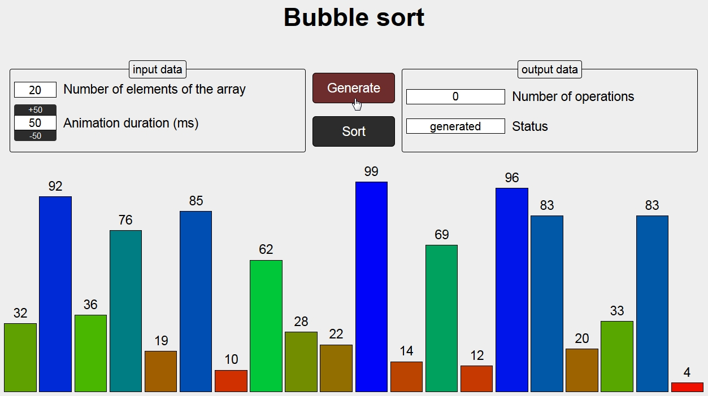
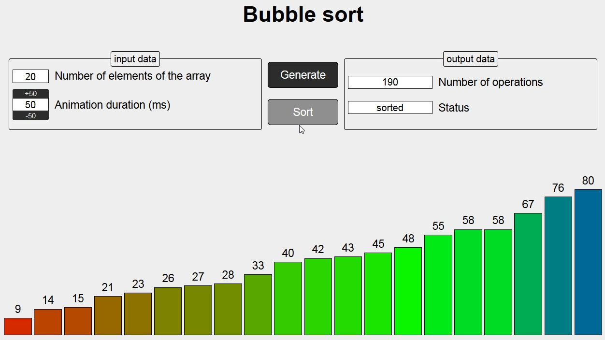

# Animation-of-buble-sort-algorithm
Ссылка: https://alexaltrex.github.io/Animation-of-buble-sort-algorithm/

## Описание
Анимация алгоритма сортировки пузырьком.

## Запуск проекта:
Для установки и запуска необходимы установленные программы: Node.js, npm, Git;
1. Клонирование и запуск: git clone https://github.com/Alexaltrex/Animation-of-buble-sort-algorithm.git;
2. Переход в директорию с проектом: cd Social-network;
3. Запуск файла index.html;

## Цель проекта
* Изучение jQuery, в частности анимации.

## Разработка
* Код - jQuery v.3.4.1
* Верстка - предпроцессор SASS (конкретно SCSS)

## Структура приложения
1. Блок входных данных: количество элементов для сортировки и время анимации одного перехода (мс).
2. Блок выходных данных: количество совершенных операций, статус (generated - начальное рандомное распределение, sort in progress - сортировка, sorted - сортировка завершена).
3. Блок управления: кнопка генерации начального рандомного распределения и кнопка запуска сортировки.
4. Блок визуализации: набор прямоугольников разной высоты и цвета.
Генерация случайного распределения:

Сортировка закончена:

 
